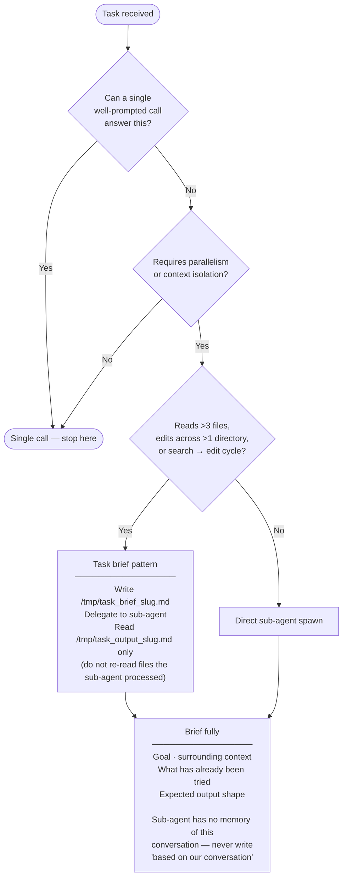

# 🔀 Orchestration decision guide

Use this flowchart before reaching for sub-agents or multi-step orchestration patterns.
Every added pattern is an added failure mode — the goal is the simplest thing that works.

## Related

- [Sub-agents](sub_agents.md) — which sub-agent to use for a given task
- [`rules/cost_efficiency.md`](../../../src/claude/rules/cost_efficiency.md) — the underlying rules this diagram visualises
