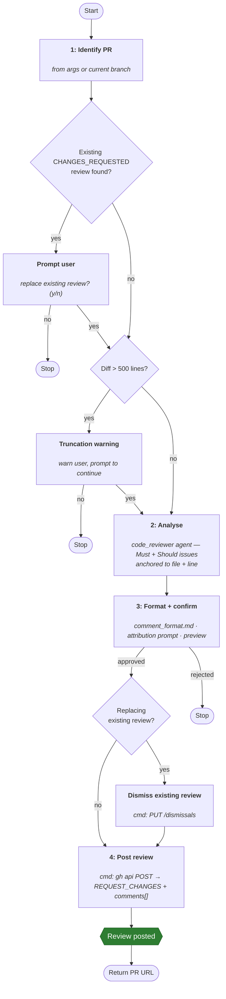

# 🔀 Skill flow

```mermaid
flowchart TD
    A([Start]) --> B

    B["<b>1: Identify PR</b>

<i>from args or current branch</i>"]

    B --> C{"Existing CHANGES_REQUESTED\nreview found?"}

    C -- yes --> C1["<b>Prompt user</b>

<i>replace existing review? (y/n)</i>"]
    C1 -- no --> Z1([Stop])
    C1 -- yes --> T
    C -- no --> T

    T{"Diff > 500 lines?"}
    T -- yes --> T1["<b>Truncation warning</b>

<i>warn user, prompt to continue</i>"]
    T1 -- no --> Z3([Stop])
    T1 -- yes --> D
    T -- no --> D

    D["<b>2: Analyse</b>

<i>code_reviewer agent — Must + Should issues
anchored to file + line</i>"]

    D --> E

    E["<b>3: Format + confirm</b>

<i>comment_format.md · attribution prompt · preview</i>"]

    E -- approved --> F{"Replacing\nexisting review?"}
    E -- rejected --> Z2([Stop])

    F -- yes --> F1["<b>Dismiss existing review</b>

<i>cmd: PUT /dismissals</i>"]
    F -- no --> G
    F1 --> G

    G["<b>4: Post review</b>

<i>cmd: gh api POST → REQUEST_CHANGES + comments[]</i>"]

    M{{Review posted}}

    G --> M --> H([Return PR URL])

    classDef milestone fill:#2e7d32,stroke:#1b5e20,color:#fff,font-size:18px
    class M milestone
```
