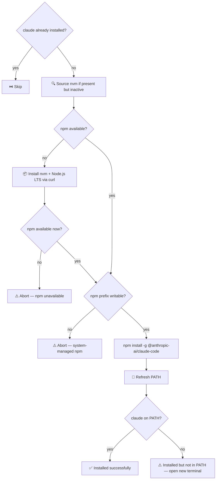

# ⚡ install_claude_cli.sh

Installs the Claude CLI (`@anthropic-ai/claude-code`) via npm, handling Node.js and nvm prerequisites automatically.

## 🔄 Flow



## 🪜 Steps

1. Skip if `claude` is already on `PATH`
2. Source nvm if installed but not active in the current subshell
3. If `npm` is not found, install nvm v0.40.3 and Node.js LTS via the official nvm install script
4. Guard: abort with a warning if `npm` is still unavailable
5. Guard: abort with a warning if the npm global prefix is not user-writable (system-managed npm)
6. Run `npm install -g @anthropic-ai/claude-code`
7. Attempt to refresh `PATH` (re-source nvm, Homebrew shell env, `hash -r`)
8. Confirm `claude` is on `PATH`; warn if not yet visible

## ⚠️ Notes

- **System-managed npm** (installed via `apt` or a package installer): the global prefix is typically not user-writable. Use [nvm](https://github.com/nvm-sh/nvm) instead.
- **PATH not updated immediately**: if `claude` is not found after install, open a new terminal or run `source ~/.nvm/nvm.sh`.
- nvm version is pinned to `v0.40.3` in the script — check [github.com/nvm-sh/nvm/releases](https://github.com/nvm-sh/nvm/releases) for the latest version and update the pin in `install_claude_cli.sh` periodically.

## 🚀 Usage

```bash
make install_claude_cli                           # standard usage
bash src/sh/claude/install_claude_cli.sh          # direct invocation (from repo root)
```
