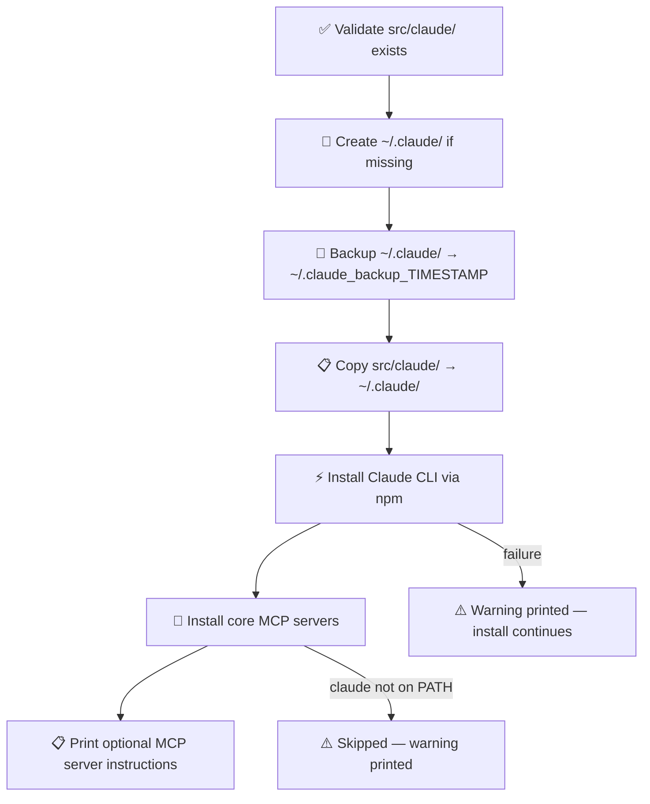

# 📦 install_claude_files.sh

Deploys repo-managed Claude config files into `~/.claude/`, then bootstraps the Claude CLI and core MCP servers.

## 🔄 Flow



## 🪜 Steps

1. Validate `src/claude/` exists — exits if missing
2. Create `~/.claude/` if it does not exist
3. Back up existing `~/.claude/` by **moving** it to a timestamped directory
4. Copy all files from `src/claude/` into `~/.claude/`; set `+x` on `.sh` files
5. Install Claude CLI via `npm` *(optional)*
6. Install core MCP servers *(optional — skipped if `claude` not on `PATH`)*
7. Print manual install instructions for optional MCP servers

## ⚠️ Optional steps

Steps 5 and 6 are non-fatal — a failure prints a warning and the install continues. To re-run them individually:

```bash
make install_claude_cli
make install_core_mcp_servers
```

## 🔌 Optional MCP servers

| Server | Prerequisite | Install command |
|---|---|---|
| GitHub | PAT with `repo` scope | `bash src/sh/claude/install_mcp_servers.sh github` |
| Atlassian | SSO (opens browser) | `bash src/sh/claude/install_mcp_servers.sh atlassian` |
| Microsoft 365 | Claude web UI only | Cannot be configured via CLI |

## 🚀 Usage

```bash
make install                                      # standard first-time setup
bash src/sh/claude/install_claude_files.sh        # direct invocation (from repo root)
```
