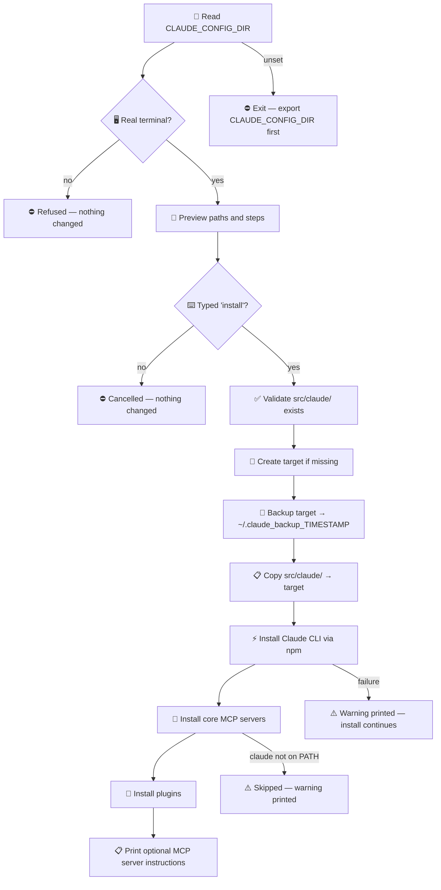

# 📦 install_claude_files.sh

Deploys repo-managed Claude config files into `$CLAUDE_CONFIG_DIR`, then bootstraps the Claude CLI, core MCP servers and plugins — but only after you preview the changes and type `install` at your own terminal.

## 🔄 Flow


```mermaid
flowchart TD
    Z[🎯 Read CLAUDE_CONFIG_DIR] --> Y{🖥️ Real terminal?}
    Y -- no --> Y1[⛔ Refused — nothing changed]
    Y -- yes --> X[👀 Preview paths and steps]
    X --> W{⌨️ Typed 'install'?}
    W -- no --> W1[⛔ Cancelled — nothing changed]
    W -- yes --> A[✅ Validate src/claude/ exists]
    A --> B[📁 Create target if missing]
    B --> C[💾 Backup target → ~/.claude_backup_TIMESTAMP]
    C --> D[📋 Copy src/claude/ → target]
    D --> E[⚡ Install Claude CLI via npm]
    E --> F[🔌 Install core MCP servers]
    F --> P[🧩 Install plugins]
    P --> G[📋 Print optional MCP server instructions]

    Z -- unset --> Z1[⛔ Exit — export CLAUDE_CONFIG_DIR first]
    E -- failure --> E1[⚠️ Warning printed — install continues]
    F -- claude not on PATH --> F1[⚠️ Skipped — warning printed]
```

## 🪜 Steps

1. Read the target from `CLAUDE_CONFIG_DIR` — exits if unset, never falls back to `~/.claude`
2. Refuse unless stdin is a real terminal, so Claude's Bash tool can't run it
3. Preview source, target, backup path and the install steps, then wait for you to type `install` — any other answer cancels
4. Validate `src/claude/` exists — exits if missing
5. Create the target if it does not exist
6. Back up the existing target by **moving** it to a timestamped directory
7. Copy all files from `src/claude/` into the target; set `+x` on `.sh` files
8. Install Claude CLI via `npm` *(optional)*
9. Install core MCP servers *(optional — skipped if `claude` not on `PATH`)*
10. Install Claude Code plugins *(optional — skipped if `claude` not on `PATH`)*
11. Print manual install instructions for optional MCP servers

## ⚠️ Optional steps

Steps 8 to 10 are non-fatal — a failure prints a warning and the install continues. To re-run them individually:

```bash
bash src/sh/claude/install_claude_cli.sh
make install_core_mcp_servers
make install_plugins
```

## 🔌 Optional MCP servers

| Server | Prerequisite | Install command |
|---|---|---|
| GitHub | PAT with `repo` scope | `bash src/sh/claude/install_mcp_servers.sh github` |
| Atlassian | SSO (opens browser) | `bash src/sh/claude/install_mcp_servers.sh atlassian` |
| Microsoft 365 | Claude web UI only | Cannot be configured via CLI |

## 🚀 Usage

Run from your own terminal, at the repo root:

```bash
export CLAUDE_CONFIG_DIR="$HOME/claude"
make install                                      # standard setup and re-sync
bash src/sh/claude/install_claude_files.sh        # direct invocation
```
