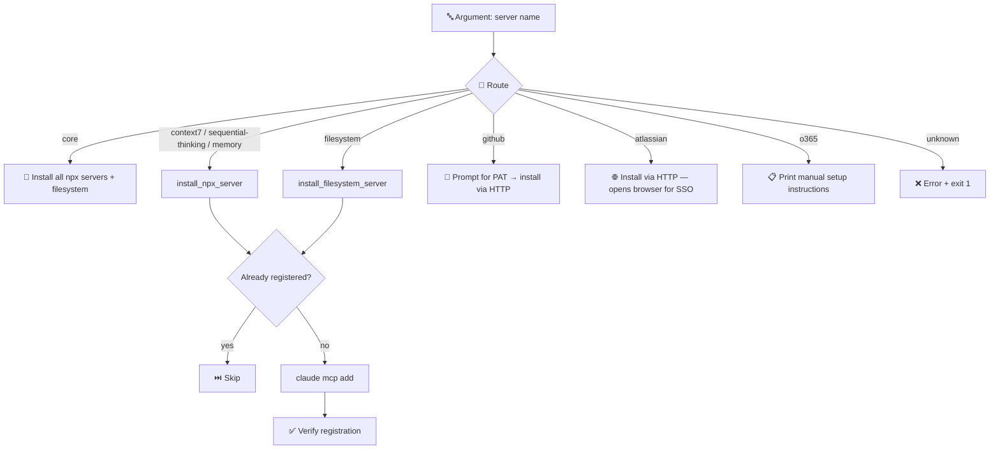

# 🔌 install_mcp_servers.sh

Installs a named MCP server (or all core servers) into Claude at user scope. Takes a single argument identifying the target server.

## 🔄 Flow



## 🗂️ Servers

| Server | Group | Install method | Prerequisite |
|---|---|---|---|
| `context7` | core | npx | none |
| `sequential-thinking` | core | npx | none |
| `memory` | core | npx | none |
| `filesystem` | core | npx, scoped to `$HOME` | none |
| `github` | optional | HTTP | PAT with `repo` scope |
| `atlassian` | optional | HTTP + SSO | opens browser |
| `o365` | optional | manual only | Claude web UI |

## 🚀 Usage

```bash
# Install all core servers
bash src/sh/claude/install_mcp_servers.sh core

# Install a single server
bash src/sh/claude/install_mcp_servers.sh github
bash src/sh/claude/install_mcp_servers.sh atlassian

# Via make targets
make install_core_mcp_servers
```

## ⚠️ Prerequisites

- Must be run from the repo root.
- Requires `claude` CLI on `PATH` — except for `o365`, which only prints manual setup instructions.
