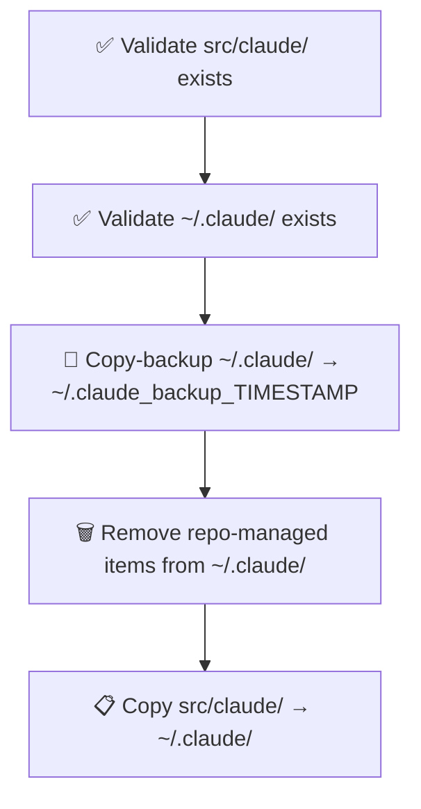

# 🔄 update_claude_files.sh

Syncs repo-managed Claude config files into `~/.claude/`, replacing only the files this repo owns and preserving everything else (e.g. `projects/`, `plugins/`).

## 🔄 Flow



## 🪜 Steps

1. Validate `src/claude/` exists — exits if missing
2. Validate `~/.claude/` exists — exits if missing (run `make install` first)
3. Back up `~/.claude/` by **copying** it to a timestamped directory (original stays in place)
4. Remove repo-managed items from `~/.claude/` — these are any files or directories whose names match items in `src/claude/`; anything else (e.g. `projects/`, `plugins/`) is left untouched
5. Copy all files from `src/claude/` into `~/.claude/`; set `+x` on `.sh` files

> **💡 Why copy-backup, not move?** Unlike install, update keeps `~/.claude/` live throughout — the copy backup is a safety net, not a replacement strategy.

## 🚀 Usage

```bash
make update                                       # standard usage
bash src/sh/claude/update_claude_files.sh         # direct invocation (from repo root)
```
